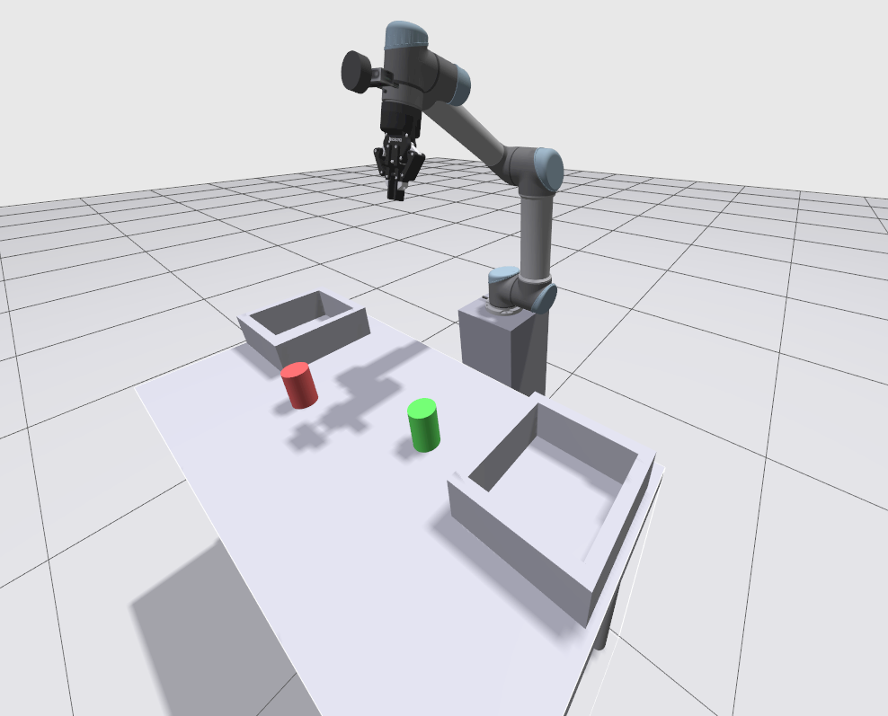
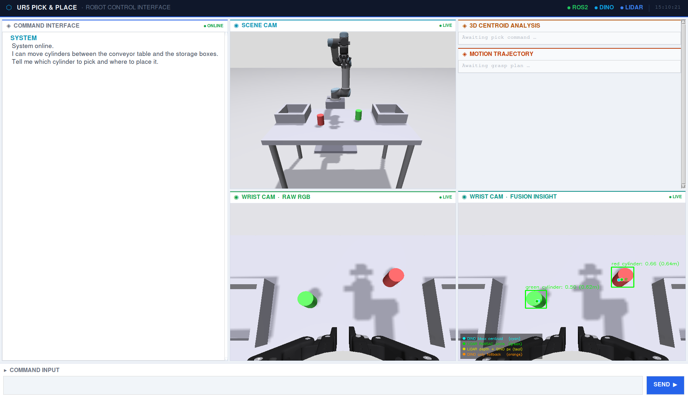

# Sensor-Fused 3D Perception for LLM-Driven Pick-and-Place Robot

A full-stack robotic manipulation system that combines **LiDAR–camera sensor fusion**, **open-vocabulary visual perception** (Grounding DINO), and **LLM-driven natural language control** to autonomously sort objects on a tabletop using a UR5 arm — all running in ROS 2 / Gazebo simulation.


---

## Demo

> **Gazebo Simulation Environment — UR5 Tabletop Scene**



> **Robot Control Interface — Chat · Wrist Cam · Fusion Insight · 3D Centroid Analysis**



---

## System Overview

```
User (natural language)
        │
        ▼
┌─────────────────────┐
│   LLM Commander     │  GPT-4o / Ollama — parses intent → pick/place plan
└────────┬────────────┘
         │
         ▼
┌─────────────────────┐     ┌──────────────────────────┐
│  VLM Perception     │────▶│  LiDAR Fusion Node        │
│  (Grounding DINO)   │     │  RANSAC circle fit on XY   │
│  2D bbox detection  │     │  → world-frame 3D centroid │
└─────────────────────┘     └────────────┬─────────────┘
                                          │
                                          ▼
                             ┌────────────────────────┐
                             │   MoveIt 2 Task Node    │
                             │   UR5 · Cartesian+OMPL  │
                             │   Grasp · Place         │
                             └────────────────────────┘
```

---

## Key Features

- **LiDAR–Camera Sensor Fusion** — RANSAC circle fitting on height-filtered LiDAR point clouds estimates world-frame 3D centroids of cylindrical objects, achieving an average **62% localisation error reduction** over camera-only baseline
- **Grounding DINO** — zero-shot open-vocabulary 2D object detection; no retraining required for new object categories
- **LLM Robot Control Interface** — natural language commands (e.g. *"move the red cylinder to the right box"*) parsed by GPT-4o/Ollama into structured pick-and-place plans
- **MoveIt 2 Motion Planning** — Cartesian and OMPL trajectory execution on a UR5 arm with gripper-geometry-aware grasp depth and box-clearance safety constraints
- **Real-time Fusion Debug View** — live wrist camera overlay showing per-method 3D centroids (camera vs. LiDAR-fused) and 3D centroid analysis with error metrics

---

## 3D Centroid Analysis

The system evaluates localisation accuracy per object in real time:

| Target | Method | 3D Error | Improvement |
|---|---|---|---|
| Red Cylinder | Camera only | 1.85 cm | — |
| Red Cylinder | LiDAR-RANSAC | 0.90 cm | **+51.2%** |
| Green Cylinder | Camera only | 1.24 cm | — |
| Green Cylinder | LiDAR-RANSAC | 0.34 cm | **+72.7%** |

---

## Architecture

| Node | Role |
|---|---|
| `vlm_perception_node` | Runs Grounding DINO on wrist camera stream; publishes 2D detections + 3D camera-frame centroids |
| `lidar_fusion_node` | Fuses LiDAR point clouds with DINO bboxes via RANSAC circle fit; publishes world-frame 3D centroids |
| `llm_commander_node` | Sends DINO prompt on user command; calls GPT-4o/Ollama to parse intent; builds pick-and-place plan |
| `moveit_task_node` | Executes pick-and-place trajectory on UR5 via MoveIt 2 |
| `chatbox_node` | Tkinter GUI — chat interface, live wrist cam feed, fusion insight panel, 3D centroid analysis |

---

## Tech Stack

| Category | Technologies |
|---|---|
| Robotics | ROS 2 Humble, MoveIt 2, Gazebo Harmonic, UR5, Robotiq gripper |
| Perception | Grounding DINO, OpenCV, LiDAR point cloud, TF2, camera intrinsics |
| Sensor Fusion | RANSAC circle fitting, LiDAR–camera projection, world-frame TF transforms |
| AI / LLM | GPT-4o, Ollama, open-vocabulary VLM |
| Motion Planning | Cartesian path planning, OMPL, MoveIt 2 |
| Language | Python, C++ |

---

## Requirements

- ROS 2 Humble
- Gazebo Harmonic
- MoveIt 2
- Python 3.10+
- [Grounding DINO](https://github.com/IDEA-Research/GroundingDINO)
- OpenAI API key **or** Ollama running locally
- `ros2_robotiq_gripper`, `ur_description`, `tabletop_moveit_config`

---

## Installation & Usage

### 1. Clone and build

```bash
git clone https://github.com/hungdothanh/sensor-fused-manipulation-robot.git
cd sensor-fused-manipulation-robot
colcon build
source install/setup.bash
```

### 2. Launch the simulation (Terminal 1)

```bash
ros2 launch tabletop_manipulation simulation.launch.py
```

This starts Gazebo with the tabletop scene, UR5 arm, and all ROS 2 bridges.

### 3. Launch the manipulation stack (Terminal 2)

```bash
ros2 launch tabletop_manipulation manipulation.launch.py openai_api_key:=sk-...
```

Replace `sk-...` with your OpenAI API key. This starts:
- Grounding DINO perception node
- LiDAR fusion node
- LLM commander node
- MoveIt 2 task node
- Chatbox GUI

> **Using Ollama instead of OpenAI?**
> ```bash
> ros2 launch tabletop_manipulation manipulation.launch.py ollama_model:=llama3
> ```

### 4. Interact

Type natural language commands in the chat GUI:
```
"Move the red cylinder to the right box."
"Pick up the green cylinder and place it in the left box."
```

---

## Repository Structure

```
src/
├── tabletop_manipulation/        # Main package
│   ├── tabletop_manipulation/
│   │   ├── vlm_perception_node.py
│   │   ├── lidar_fusion_node.py
│   │   ├── llm_commander_node.py
│   │   ├── moveit_task_node.py
│   │   ├── chatbox_node.py
│   │   └── constants.py
│   ├── launch/
│   │   ├── simulation.launch.py
│   │   └── manipulation.launch.py
│   └── worlds/
│       └── tabletop.sdf
├── tabletop_moveit_config/       # MoveIt 2 config for UR5
└── ros2_robotiq_gripper/         # Robotiq gripper driver
```

---

## License

MIT
